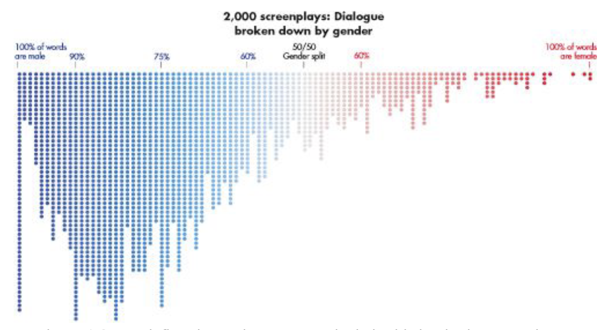

# Report Title: Dialogue broken by gender

## By Lucas Cho

Report Date: _April 7, 2023_

## Data Viz Summary

This visualization shows the summary of 2000 screenplays broken down by gender and age. It is created by Hanah Anderson and Matt Daniels, who are the founders of The Pudding, a data journalism start-up in 2017. It is evident that there are numerous screenplays which are male-dominant while there is only few with 100% of words from female. 

According to *Data Feminism*, 
> "in this book, we pay particular attention to inequalities at
the intersection of gender and race. This reflects our location in the United States,
where the most entrenched issues of inequality have racism at their source."

## Data Viz Biography

1. **Who or what institution produced the visualization? (Hint: refer to "Figure Credits")**
   
   Hanah Anderson and Matt Daniels produced the visualization.
   
2. **When was it produced?**
   
   They produced in 2017.
   
3. **Who is the audience for the visualization?**
   
   The audiences are people who are interested in the data journalism start-up they created.
   
4. **How might the visualization be interpreted or misinterpreted? What consequences might this interpretation/misinterpretation have?**
   
   It is evident that there are more male-dominant dialogue in the film industry in the time that they focused on. This might lead people to have interest in data feminism or start to wonder the reason behind the result.
   
5. **How, if at all, does the data visualization represent power or systems?**
   
   From this visualization, it is very clear that men had the power all over the film industry while women did not have much opportunity compare to the men.

The image is from the book, [Data Feminism](https://data-feminism.mitpress.mit.edu/). :bar_chart:
